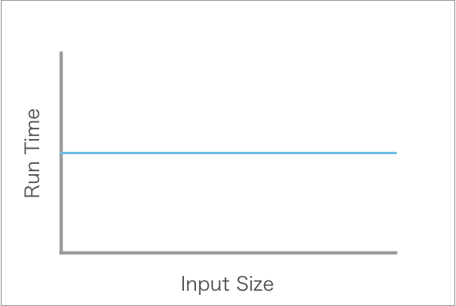
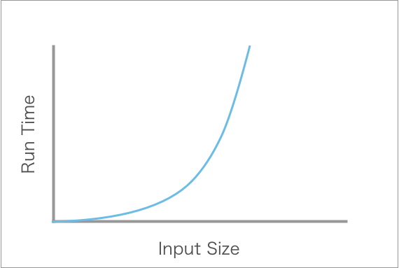
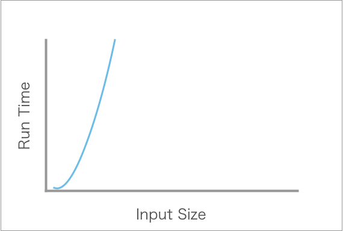
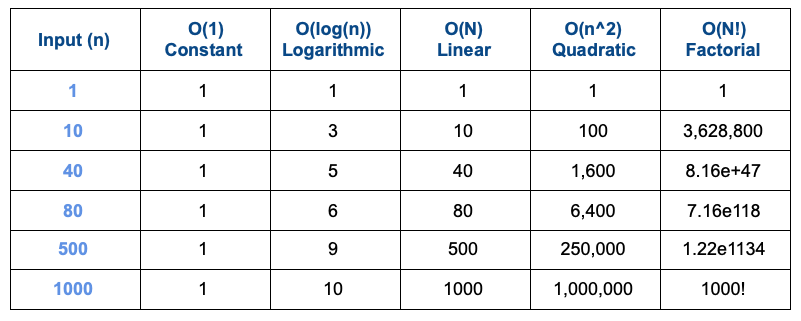

# Big O

## Learning Objectives

- Explain why developers analyze Big O.
- Describe what is Big O is.
- Be able to calculate Big O of a function with the following types of notations:
  - Constant O(1)
  - Linear O(n)
  - Quadratic O(n^2) or O(n\*m)
  - Factorial O(n!)
  - Logarithmic O(log n)
- Analyze two functions that do the same thing.

# Big O Notation

We are going to be introducing computer science concepts. These will suit you best for interviews and further into your career. Some of these concepts are rather complicated and will take time to come together for you. Don't worry if you don't get it right away. With time and practice, the pieces will come together.

Our focus has been on projects and skills first rather than focusing on theory. We believe building things is the best way to learn to code and become a developer. However, it's essential to set aside some time to learn core computer science concepts so that you can continue to grow as a developer.

What may be a little confusing is that we are going to start talking about optimization. But as you likely remember, one of the biggest pieces of advice we probably have been giving is: Don't optimize too early! This is still true for your work. Focus on building first and then the optimization.

Still, what does optimization mean? We'll look at what it means through the lens of Big O in this lesson.

One of the things computer scientists are trained to do is to find ways to make things faster, smaller, cheaper, and more precise. One way to approach such problems is to consider the worst-case scenario.

The worst case scenario is that whichever algorithm is being analyzed, it will take the most amount of time possible. For example, if we are searching through an array, we assume that the item will always be found last and that the array size is enormous.

Big O Notation is a way to denote the worst-case scenario. Similar notations indicate average and best-case scenarios, but we will not cover those today.

The name Big O comes from the math discipline and describes the relationship between functions and their growth rates.

Big O of Algorithms is measured by:

- **Time complexity** - the amount of time it takes the function to complete. It is measured in the number of steps an algorithm takes rather than measures of time, like seconds or minutes.
- **Space complexity** - the amount of memory (RAM) required for an algorithm to run.

Each complexity can be described with a notation like `O(n)`: Where n represents the number of elements.

Additionally, Big O can be represented visually with the execution time/memory on the y-axis and input size on the x-axis.


As the input size increases, the execution time can change based on the algorithm used.

For our introduction, we'll only consider time complexity and worst-case scenarios. In your studies, as you continue to learn, you should learn and consider space complexity and other scenarios as well.

We will look at five classes of growth complexity. There are more, but these are the ones that appear most often.

### Set Up

We'll be using the same example throughout - a cloud music service.

If our service is small - 100 artists, and 100 users, we don't have to worry about optimization. Computers are pretty fast.

However, as our cloud music service grows with more music and users, we want to improve optimization.

- Better user experience if someone says, 'Hey, Siri/Alexa play Silicone on Sapphire, ' and there are over 20 million songs to search through. This request could take a minute. But we don't want to wait a minute! We will think our assistant did not hear us or is broken if we have to wait a whole minute. We need our results as fast as possible.
- Better resource usage. Storing and delivering millions of songs to millions of users takes a lot of computing power. If there are more efficient ways, it will save resources

Let's think that we have an array of artists. Each artist is made up of an object. Each artist has an array of objects that are albums. Each album is an array of song names.

```js
const artists = [
  {
    name: "Miles Davis",
    albums: [
      {
        title: "In a Silent Way",
        songs: ["Shhh/Peaceful", "In a Silent Way/It's About That Time"],
      },
      {
        title: "Milestones",
        songs: [
          "Dr. Jekyl",
          "Sid's Ahead",
          ///...
        ],
      },
    ],
  },
  {
    name: "Dolly Parton",
    albums: [
      {
        title: "Jolene",
        songs: [
          //...
        ],
      },
      {
        title: "9 to 5 and Other Odd Jobs",
        songs: [
          // ...
        ],
      },
    ],
  },
];
```

### Constant `O(1)`

"Play the first song from The Star Wars Soundtrack."

```js
const getFirstSongFromPlaylist = (album) => {
  console.log(album[0]);
};
```

This algorithm has a Big O complexity of `constant`. No matter the array size, 1 or 1 million, this always takes the same time and memory to execute. It does not matter if the Star Wars soundtrack has 1 song or a hundred million. The time it takes to complete this will be the same.

This type of complexity is considered highly efficient.



### Linear `O(n)`

"What songs are on the playlist of eponymous debuts?

```js
const printSongs = (album) => {
  for (let n = 0; n < album.length; n++) {
    console.log(album[n]);
  }
};
```

This algorithm has a Big O complexity of `linear`. For each added song to the array, the amount of time it takes to complete this is increased by 1 step.

If the array (or playlist) has 1 item, it will take 1 step to complete. The function will take a million steps to complete if it has a million items.

This type of complexity is considered pretty good efficiency.


### Quadratic Complexity `O(n*m)` or `O(n^2)`

"List every song on all albums."

```js
const PrintSongsWithinAlbums = (artist) => {
  for (let n = 0; n < artist.albums.length; n++) {
    for (let m = 0; m < artist.album.songs.length; m++) {
      console.log(artist.album[n].songs[m]);
    }
  }
};
```

This algorithm has a Big O complexity of `quadratic`. For each album added item to the array, the amount of time it takes to complete this is increased by `n` and for each song added the complexity is increased by `m`. For an increasing complexity of `n*m`. (or `n^2` if you are certain that `m` is always equal to `n`).

Imagine you wanted to print every song by an artist. The above function would loop through each album and then, within each album, loop through each song. For each album, the complexity doesn't increase just by 1 step, but by each album times each song on the album.

If every artist has 10 albums and each album has 10 songs, we go through the steps 10 times for the albums and then times for each song, so for a collection of 10 albums, we go through the algorithm 100 times. If we had 100 albums and still 10 songs, we'd go through this algorithm 1000 times. When calculating Big O, we assume that every artist will continue to increase the number of albums and albums per song.

If we were also to have to go through all of the artists, and now every artist has 10 albums, and each album has 10 songs, the number of steps we have to take increases quite quickly!

More complexity:

```js
const PrintSongsWithinAlbumsByArtist = () => {
  for (let n = 0; n < artists.length; n++) {
    for (let m = 0; m < artists[n].albums.length; m++) {
      for (let k = 0; k < artists[n].album[m].songs.length; k++) {
        console.log(artists[n].albums[m].songs[k]);
      }
    }
  }
};

// Alternative syntax to help with readability
for (let artist of artists) {
  for (let albums of artist.albums) {
    for (let songs of album.songs) {
      console.log(songs);
    }
  }
}
```

Now we have a collection of artists, as we gain each artist with 10 albums and then 10 songs per album. We get 10 songs and 10 albums each time we add an artist. With 10 artists, we get 10 x 10 x 10 = 1000 steps or `O(n * m * k)`

> **Note:** You don't have to stick with `n` or `m`. You can name these variables in a more semantic way. You can write `O(artists * albums * songs)` and still identify this as `quadratic`. Using more semantic naming can be helpful.

This type of complexity is considered inefficient. It is also important to note that there isn't a more efficient way for this particular ask. We want every single song! Not every other song, not a random selection of 10. And that that's ok.



If you need better speed/efficiency but can't change from a triple nested loop, What else can you do to make things go faster? What you could consider is adding functionality where the user only sees the first 100 songs and must scroll or push a button to get more. Or choosing not to load all of the artwork right away.

### Factorial Complexity `O(n!)`

"Play the album Hamilton, over and over again until I've heard every song in every order possible."

Factorial means the product of all positive integers less than or equal to n.

Examples

- 3 factorial is 3 x 2 x 1
- 7 factorial is 7 x 6 x 5 x 4 x 3 x 2 x 1

The complexity of the factorial algorithm increases faster than in any other example. While there are real-world examples of these types of algorithms, due to their complexity, they are not typically asked in coding interviews for jr positions, and thus we won't include an code example here.

This type of complexity is considered inefficient.



You can [read about an inefficient sorting algorithm called Bogosort that has a factorial run time](https://en.wikipedia.org/wiki/Bogosort) if you want a more in-depth example. Typically factorial complexity algorithms come up in terms of permutations or creating combinations of things.

### Logarithmic Complexity `O(log(n))`

"Play I Can't Get No Satisfaction"

How is our assistant finding our song?

Is it going randomly through every single song in the database?

Is it looking by artist and then by song (again without any organization)?

In either scenario, you'd have to consider the worst-case scenario: the song you ask for is always the last song found.

What if the songs were organized alphabetically?

Then we could perform a `binary search`.

We would start in the middle and then check if there is a match. If it matches, we're done!

But with Big O, we're always thinking about the worst-case scenario and that our song will be the last song found.

So we start in the middle. Let's say this middle is songs that begin with the letter `M`. If our song starts with the letter `I`, we can eliminate all the songs that begin with M or further in the alphabet. Now we've cut down the number of items we must search by half.

Let's set our next midpoint to be the middle of the remaining songs, and we get songs that start with the letter `F`. Since our song begins with the letter `I`, we can stop searching through songs starting with A - F and, again, cut our search down by half.

We would keep repeating, removing half of the songs we were looking through until we found our song. This more complicated process is more efficient than looking through every single song and can be represented in this image.


And as this code:

```js
function artistSearch(artists, artist, first = 0, last = null) {
  if (!last) last = artists.length;
  let midpoint = Math.floor((last - first) / 2) + first;
  if (artists[midpoint] === artist) return midpoint;
  if (artists[midpoint] > artist)
    return artistSearch(artists, artist, first, midpoint);
  if (artists[midpoint] < artist)
    return artistSearch(artists, artist, midpoint, last);
}
```

In this way, if we have 16 songs, the number of steps would be 4 Log(2) of 16 = 4.

If we have about 1.126 million songs, the number of steps would be just 50!

This type of complexity is considered highly efficient. But notice it is not very efficient at first. It only becomes efficient as the number of items increases. Therefore, this may not be the best solution for smaller data sets.


Now that we found the artist, we can do something similar to find the song.

You can return to the problem you had in the pre-reading and apply the same logic.

- First guess the middle number
- Check if it is too big or small
- Adjust the bounds/limits for the range
- Guess the middle number again
- Repeat until the solution is found


<details><summary>One possible solution</summary>

```js
const gameVersion3 = (limit = 1000) => {
  let theNumber = Math.ceil(Math.random() * limit);

  guess = Math.floor(limit / 2);
  let count = 1;
  // start with a lower bound
  let lowerBound = 0;

  while (guess !== theNumber && count < 10) {
    if (guess < theNumber) {
      console.log(`Too low! Guess again!`);
      // limit is still the limit
      // lowerBound is now guess
      lowerBound = guess;
      // guess is Math.floor(limit - lowerBound)
      guess = Math.floor((limit - lowerBound) / 2) + lowerBound;
      //   console.log("new guess", guess);
    } else {
      console.log(`Too high! Guess again!`);
      // limit is now guess
      limit = guess;
      // lowerBound is still lowerBound
      // guess is Math.floor(limit - lowerBound)
      guess = Math.floor((limit - lowerBound) / 2) + lowerBound;
      //   console.log("new guess", guess);
    }
    count++;
  }
  console.log(
    `That's right! The number was ${theNumber}. The number of guesses was ${count}`
  );
};
```


</details>


What is the Big O for this game?

If the number range is 1 - 1000, how likely is it that you will be able to guess the correct number in 10 guesses or less?

## Summary

We can look at this chart to see how efficiency changes as the input increase across the different types of complexity classes.



Again, we can see that in most cases, when looking at 500 or fewer items, our computers can work through them quickly, and our primary concern in this course should not be efficiency or optimization.

Early optimization is problematic because it can be overwhelming to think about as you start to solve a problem or build an app. It can prevent you from building a prototype in a reasonable amount of time.

Additionally, as you build your app with optimization in mind, you will inevitably try to solve problems you won't have, which is terrible for things like deadlines. And also, since you don't yet know what all your problems will be, you must build to learn what you'll need to solve.

The approach that will serve you best in this course, and likely well into your career, is by a quote from Addy Osmani.

```
First, do it,
then do it right,
then do it better
```

Again focusing on just solving your problem first and foremost. Then going and finding the right way to do it and, finally, find ways to do it better.

## More Considerations

### Drop Constants

When calculating Big O, it describes the rate of increase - therefore, it is typical to drop the constants.

Let's take a look

Imagine we have an array of random positive integers between 1 and a million, and our array size is larger than 100,000 numbers.

We want to find both the largest number and the smallest number.

We can take two approaches, using for loops.

```js
let min = 0;
let max = 0;
for (let n of numbersArray) {
  if (x < min) min = x;
  if (x > max) max = x;
}
```

Calculate Big O for yourself, and then check

<details><summary>
Big O</summary>

- for loop = N
- two steps inside of for loop = 2

O(2N)

2 is constant, so we can just write O(N)

</details>

```js
let min = 0;
let max = 0;
for (let n of numbersArray) {
  if (x < min) min = x;
}
for (let n of numbersArray) {
  if (x > max) max = x;
}
```

Calculate Big O for yourself, and then check

<details><summary>
Big O</summary>

- first for loop = N
- one step inside of for loop = 1
- second for loop = N
- one inside of for loop = 1

O(2N)

</details>

The rate always increases by the number of elements: `N`, the 2 is a constant. We don't need constants - therefore, for both of these examples, Big O is O(N).

This also means that when loops are not nested, you add the values. You do not multiply them as if they were nested.

### Drop Non-Dominant Terms

Consider an algorithm that has a complexity of

- O(N^2 + N)

| input |         runtime         |
| :---: | :---------------------: |
|   1   |        2 + 1 = 3        |
|  10   |     100 + 20 = 110      |
|  100  |   10000 + 100 = 10100   |
| 1000  | 1000000+ 1000 = 1001000 |

As N grows, the impact of `N` decreases, while `N^2` dominates the runtime in a worst-case scenario. Therefore we would change this Big O to O(N^2)

### Adding vs. Multiplying

Consider the two following examples:

Here are two loops - we added the steps previously for O(2N), then dropped the constant for O(N)

```js
let min = 0;
let max = 0;
for (let n of numbersArray) {
  if (x < min) min = x;
}
for (let n of numbersArray) {
  if (x > max) max = x;
}
```

Here is a nested with two steps:

```js
const someNestedArray = []
let sum = 0
for (let a row of someNestedArray) {
 for (let item of row) {
 console.log(item, row)
 sum += item
 }
 }
}

```

We will multiply when the loops are nested.

- **N** first loop
- **M** for second loop
- For every time the outside loop runs, the inside loop runs again
- **IMPORTANT** in this example, it is ambiguous if N and M are the same. Therefore it is NOT `N^2`. It is `N*M`
- You do not have to use `N` or `M`. You can use `P` for prime numbers, `W` for letters, or any more descriptive variable name

O(N\*M)

### Dealing with Ambiguity

```js
function first(array) {
  for (let item of array) {
    someFunc1(item);
  }
}

function second(array) {
  for (let item of array) {
    someFunc2(item);
  }
}
```

In this case there are two similar functions that seem to have a linear runtime.

However, you don’t know the runtime of someFunc1 or someFunc2. Therefore the runtime may or may not be comparable.

If you notice ambiguity it is ok to call it out.

## Next

Do you feel like you need to hear it all again?

Here is a compilation of videos and resources [Code Chef](https://www.codechef.com/certification/data-structures-and-algorithms/prepare)

## Further Reading

[Gayle Laakman McDowell Big O Crash Course for Uber](https://s3.amazonaws.com/ubercandidateprep/videos/05_Big_O_Crash_Course.mp4)

[Wikipedia](https://en.wikipedia.org/wiki/Big_O_notation)

## Bonus

### Prime numbers

What is the Big O for the following:

```js
const isPrime = (num) => {
  if (num < 2) {
    return false;
  } else if (num === 2) {
    return true;
  } else {
    for (let i = 2; i < num; i++) {
      if (num % i === 0) {
        return false;
      }
    }
    return true;
  }
};

console.log(printPrimes(30));
```

Compared with:

```js
const isPrime = (num) => {
  if (num < 2) {
    return false;
  } else if (num === 2) {
    return true;
  } else {
    for (let i = 2; i <= Math.sqrt(num); i++) {
      if (num % i === 0) {
        return false;
      }
    }
    return true;
  }
};

console.log(printPrimes(30));
```

<details><summary>Answer</summary>
The first one has a Big O of O(n)

The second one has a Big of of O(n^ 0.5)

</details>

### Binary Search Guessing Game alternative syntax/solution

<details><summary>A possible alternative solution for the game/automatic guesser that has more similar syntax to the example binary search code given.</summary>

```js
const game = () => {
  let start = 1;
  let limit = 1000;
  let midpoint = 0;
  let number = Math.ceil(Math.random() * limit);
  let values = {
    start,
    limit,
    midpoint,
  };

  // let guess = prompt(`Guess a number between 1 and 1000`);
  let counter = 1;
  while (values.midpoint !== number && counter <= 10) {
    if (values.midpoint > number) {
      values = myAutomaticGuesser(values, true);
    } else if (values.midpoint < number) {
      values = myAutomaticGuesser(values, false);
    }
    counter++;
  }

  if (counter <= 11) {
    console.log(
      `That's right! The number was ${number} and the number of guesses was ${
        counter - 1
      }`
    );
  } else {
    console.log(
      `Sorry, out of guesses! The number was ${number}
 `
    );
  }
};

const myAutomaticGuesser = ({ start, midpoint, limit }, tooHigh) => {
  if (tooHigh) {
    if (midpoint === 2) midpoint = 1;
    limit = midpoint;
    midpoint = limit - Math.floor((limit - start) / 2);
  } else {
    start = midpoint;
    midpoint = limit - Math.floor((limit - start) / 2);
  }
  return { midpoint, start, limit };
};

game();
```

- What is the Big O for this game?
- With the possible values between 1 - 1000, how often will the automatic guesser run out of guesses and lose?

</details>
